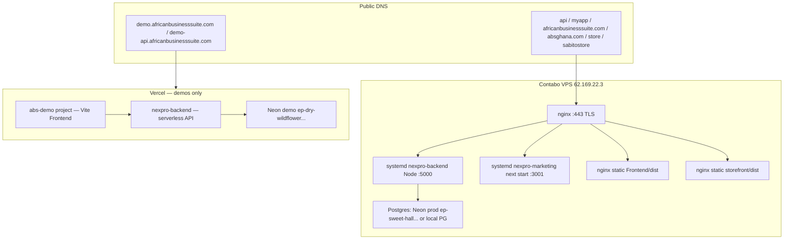

# Production on Contabo vs demos on Vercel

**Decision (2026-08):** Production = **all customer-facing web on the Contabo VPS** (API + ABS dashboard + marketing + storefront + any other public web). Demos stay on **Vercel**. Mobile apps are out of scope here (App Store / Play).

This document is the implementation plan. `DEPLOYMENT.md` remains the older Vercel-first guide; treat **this file as source of truth** for where traffic should go after cutover.

Do **not** SSH from CI until deploy keys are in place. Default VPS from existing scripts: `root@62.169.22.3`, repo `~/nexpro`.

---

## 1. Target architecture



**Git:** `main` → Contabo production. `staging` → Vercel demo projects only. Do not auto-deploy `main` to Vercel production after cutover.

---

## 2. Per-app: what runs where

| App | Path | Build | Prod (Contabo) | Demo (Vercel) |
|-----|------|-------|----------------|---------------|
| Backend API | `Backend/` | `npm start` → `node server.js` | systemd `nexpro-backend`, nginx reverse proxy to `127.0.0.1:5000` | Project **`nexpro-backend`**, root `Backend`, `vercel.json` → `api/index.js` serverless |
| ABS dashboard | `Frontend/` | Vite → `Frontend/dist` | nginx static + SPA fallback to `index.html` | Project **`abs-demo`** (`Frontend/package.json` `deploy:abs-demo`). Freeze **`shopwise_frontend`** after DNS cutover |
| Marketing | `marketing-site/` | Next.js 16 App Router (`next build` + `next start -p 3001`) | systemd Node (not static). No `output: 'standalone'` or `'export'` today | Current marketing Vercel project. After cutover: optional preview only, **not** prod domains |
| Storefront | `storefront/` | Vite → `storefront/dist` | nginx static + SPA fallback. One build serves **sabitostore.com** (marketplace) and **store.absghana.com** (Online Store) via hostname | Current sabito-store project. Freeze after cutover |
| Sabito Next app | `sabito-app/` | Next `next start -p 3003` | Only if it is a public product; otherwise leave off the VPS | Not wired in `DEPLOYMENT.md` |
| Mobile | `mobile/` | Expo | Not on VPS | Not Vercel |

**Process model on the VPS**

- **Node long-lived:** Backend (WebSockets, cron/schedulers, `/uploads`). Marketing (middleware + `next.config.ts` redirects for `/login`, `/signup`, `/shop/*`).
- **nginx static:** Vite SPAs. Mirror `Frontend/vercel.json` / `storefront/vercel.json`: `try_files $uri $uri/ /index.html`; no-cache `index.html` / `sw.js`; long-cache `/assets/`.
- **Reverse proxy:** `api.` → backend. Upgrade headers required for `/socket.io/`.

Existing helper already assumes this layout:

- Repo: `~/nexpro`
- Unit: `nexpro-backend` (pm2 fallback in `scripts/configure-sabitostore-production.sh`)
- `--build` runs `Backend` install + `npm run migrate` + `Frontend` + `storefront` builds
- **Gap:** that script does **not** build or restart `marketing-site`

There are **no nginx/Caddy configs in the repo**. They must be added (see §8).

---

## 3. DNS / SSL / nginx vhosts

VPS IP used in scripts: **`62.169.22.3`**.

### Production (point at Contabo after nginx+certs work)

| Host | Role | nginx |
|------|------|--------|
| `api.africanbusinesssuite.com` | API | proxy `127.0.0.1:5000`; WebSocket `/socket.io/` |
| `myapp.africanbusinesssuite.com` | Dashboard | `root ~/nexpro/Frontend/dist` |
| `myapp.absghana.com` | Dashboard alias | same `Frontend/dist` |
| `africanbusinesssuite.com` + `www.` | Marketing | proxy `127.0.0.1:3001` |
| `absghana.com` + `www.` | Marketing alias | same marketing upstream |
| `store.absghana.com` + `www.store.` | ABS Online Store | `root ~/nexpro/storefront/dist` |
| `templates.absghana.com` | Template gallery | same storefront dist |
| `sabitostore.com` + `www.` | Sabito marketplace | same storefront dist (hostname switches UI) |
| Merchant custom shop domains | CNAME → `store.absghana.com` | **catch-all** HTTPS vhost → same storefront dist (see `corsUtils.js` + `STOREFRONT_CNAME_TARGET`) |

Certs: **certbot** (or acme.sh) per hostname. Catch-all merchant domains need either a wildcard on a domain you control or **on-demand TLS** (later); today docs say DNS/SSL for custom domains is manual.

### Demo (stay on Vercel)

| Host | Project |
|------|---------|
| `demo-api.africanbusinesssuite.com` | `nexpro-backend` |
| `demo.africanbusinesssuite.com` | `abs-demo` (Vite Frontend) |

Keep `demo-api` and `demo` CNAME’d to Vercel. Do **not** point them at Contabo.

### Cutover DNS (order)

1. Provision nginx + certs on VPS using **temporary hostnames** or `/etc/hosts` smoke tests first.
2. Lower TTL on production records (e.g. 300s) a day ahead.
3. Switch A/CNAME **one hostname at a time**, starting with `api.` only if dashboard still on Vercel briefly **or** switch API+dashboard together (CORS/`VITE_API_URL` stay `https://api.africanbusinesssuite.com`).
4. Freeze Vercel **production** domain assignments (remove prod domains from `shopwise_backend`, `shopwise_frontend`, marketing, sabito-store). Leave demo projects attached to `demo*` only.

---

## 4. Git branching

| Branch | Deploys to | Database |
|--------|------------|----------|
| `main` | Contabo `~/nexpro` (pull/build/restart) | Production Neon `ep-sweet-hall-ahwiqkrg-pooler...` (or VPS Postgres in `Backend/.env`) |
| `staging` | Vercel **demo** only: `nexpro-backend` + `abs-demo` (+ optional demo marketing/storefront) | Demo Neon `ep-dry-wildflower-ahm0na7f-pooler...` (`Backend/.env` / `db:sync-vercel`) |
| PRs | GitHub Actions tests only (existing `.github/workflows/ci.yml`) | none |

**Today:** CI runs on `push` to `main`/`master` and all PRs. Frontend still has `deploy:production` → **`shopwise_frontend`**. Backend scripts still mention **`shopwise_backend`** as production API on Vercel. After cutover those npm scripts must not be the prod path.

**Required Vercel project settings (demo):** Production branch = **`staging`** (or ignore `main` for Production). Protect `main` from Vercel Production deploys.

**Required Contabo:** deploy workflow (or documented SSH) only on **`main`**.

Suggested flow: feature → PR to `staging` (demo UAT) → PR/merge `staging` → `main` (prod). If that is too heavy, at least: never auto-deploy `main` to Vercel prod projects.

---

## 5. Ordered checklist

### A. Infra on VPS (manual; do not rely on this agent SSH)

1. Confirm `~/nexpro` is this git remote, Node 20, `nexpro-backend` active, `Backend/.env` exists.
2. Confirm Postgres: production `DATABASE_URL` must **not** be the demo host (`canonicalDatabase.js`). Prefer keeping Neon prod or migrate to local PG later — do not mix.
3. Disk: `Backend/uploads` is persistent on VPS (unlike Vercel). Backup that directory.
4. Install **nginx** + **certbot** (repo has no Caddy). Firewall: 80/443 public; Node ports localhost-only.
5. Pin backend `PORT=5000` in `Backend/.env` so nginx upstream is stable (server currently walks `PORT`…`PORT+10` if bind fails).

### B. nginx + systemd (first PR configs, then apply on VPS)

6. Add vhosts from §3. Backend proxy must include:
   - `proxy_http_version 1.1`
   - `Upgrade` / `Connection` for `/socket.io/`
   - `client_max_body_size` large enough for uploads
7. SPA: `try_files` for Frontend + storefront.
8. Marketing: `proxy_pass http://127.0.0.1:3001` (not the `dist` folder).
9. New unit `nexpro-marketing.service`: `WorkingDirectory=~/nexpro/marketing-site`, `ExecStart=/usr/bin/npm start` (or `node .next/standalone/...` after standalone output).
10. Optional later: `output: 'standalone'` in `marketing-site/next.config.ts` to shrink runtime.

### C. Env on Contabo

11. Run `~/nexpro/scripts/configure-sabitostore-production.sh --env-only` then inspect diffs (script already sets CORS, storefront, Google, writes `Frontend/.env.production` and `storefront/.env.production`).
12. Extend Frontend `.env.production`:
    - `VITE_WS_ENABLED=true` (**required change:** `useWebSocket.js` currently **disables** sockets on ABS production hosts unless this is set, because the API was Vercel serverless)
    - `VITE_ONLINE_STORE_URL=https://store.absghana.com`
    - `VITE_TEMPLATES_GALLERY_URL` if used
13. Extend storefront `.env.production` with Online Store hosts (script today omits `VITE_ONLINE_STORE_HOST` / `VITE_ONLINE_STORE_URL` / `VITE_TEMPLATES_HOST` — bake them before rebuild).
14. Create `marketing-site/.env.production` (see §6). Rebuild marketing after.
15. `NODE_ENV=production` on backend. `VERCEL` must **not** be set (else Socket.IO stub + no `listen()`).
16. Rotate **Google client secret** currently defaulted in `configure-sabitostore-production.sh` — it is a secret in-repo.

### D. GitHub Actions

17. Keep `ci.yml` tests on PR + `main`/`staging`.
18. **Do not** add a full deploy YAML until SSH deploy key + host fingerprint exist in GitHub secrets. First stub (optional): `deploy-contabo.yml` with `workflow_dispatch` + `if: github.ref == 'refs/heads/main'` that SSHs `git pull && configure --build --restart && marketing build && systemctl restart nexpro-marketing`. Prefer **CI-built artifacts** later (see risks).
19. Point Vercel Git integration: Production branch `staging` for `nexpro-backend` and `abs-demo`. Disconnect or ignore `shopwise_*` production.

### E. Cutover

20. Build on VPS (`configure-sabitostore-production.sh --build --restart`) + marketing build/start. Curl:
    - `https://api.africanbusinesssuite.com/health` (after DNS or Host header + IP)
    - dashboard `/` and a client-route refresh (`/login`)
    - `https://store.absghana.com/` Online Store landing (not Sabito chrome)
    - marketing `/` and `/shop/test` → 307 to storefront
21. Flip DNS. Watch CORS, OAuth redirect URIs, Paystack callbacks (`STOREFRONT_URL`, `ONLINE_STORE_URL`).
22. Enable WebSockets in prod Frontend build; confirm `/socket.io/` is not 503 JSON.

### F. Freeze Vercel prod

23. Remove production domains from **`shopwise_backend`**, **`shopwise_frontend`**, marketing, sabito-store.
24. Stop using `npm run deploy:production` / `db:restore-production-vercel` as the prod path. Demo: `db:sync-vercel` → `nexpro-backend` only.
25. Leave Hobby/Pro Vercel for **demo + previews** only.

---

## 6. Secrets / env per host

### Contabo `~/nexpro/Backend/.env` (production)

Must include (see `Backend/env.example` + configure scripts):

| Key | Production value |
|-----|------------------|
| `NODE_ENV` | `production` |
| `PORT` | `5000` |
| `DATABASE_URL` | Prod Neon or VPS PG — **not** `ep-dry-wildflower` |
| `JWT_SECRET` / `JWT_EXPIRE` | prod secret |
| `CORS_ORIGIN` | merged list from configure script: myapp, marketing apex/www, absghana, store, sabitostore, `myapp.absghana.com` |
| `FRONTEND_URL` | `https://myapp.africanbusinesssuite.com` |
| `STOREFRONT_URL` | `https://sabitostore.com` |
| `ONLINE_STORE_URL` | `https://store.absghana.com` |
| `STOREFRONT_CNAME_TARGET` | `store.absghana.com` |
| `GOOGLE_CLIENT_ID` / `GOOGLE_CLIENT_SECRET` | Web client; authorized origins = all prod hosts |
| Paystack live keys, WhatsApp, OpenAI, platform email encryption key, Sabito keys | as today on Vercel `shopwise_backend` — copy once, do not dual-write |

Schedulers (`SABITO_SYNC_*`, marketplace payouts, reminders) **will run** on Contabo Node. They do **not** run on Vercel serverless (`DEPLOYMENT.md` §7). Confirm you want them on for prod (you do).

### Contabo `Frontend/.env.production` (Vite bake-time)

```
VITE_API_URL=https://api.africanbusinesssuite.com
VITE_STOREFRONT_URL=https://sabitostore.com
VITE_GOOGLE_CLIENT_ID=...
VITE_WS_ENABLED=true
VITE_ONLINE_STORE_URL=https://store.absghana.com
```

### Contabo `storefront/.env.production`

```
VITE_API_URL=https://api.africanbusinesssuite.com
VITE_STOREFRONT_URL=https://sabitostore.com
VITE_DASHBOARD_URL=https://myapp.africanbusinesssuite.com
VITE_ABS_APP_URL=https://myapp.africanbusinesssuite.com
VITE_ONLINE_STORE_HOST=store.absghana.com
VITE_ONLINE_STORE_URL=https://store.absghana.com
VITE_TEMPLATES_HOST=templates.absghana.com
VITE_GOOGLE_CLIENT_ID=...
```

### Contabo `marketing-site/.env.production`

```
NEXT_PUBLIC_APP_URL=https://myapp.africanbusinesssuite.com
NEXT_PUBLIC_API_URL=https://api.africanbusinesssuite.com
NEXT_PUBLIC_SITE_URL=https://africanbusinesssuite.com
NEXT_PUBLIC_ALTERNATE_SITE_URLS=https://absghana.com,https://www.absghana.com
NEXT_PUBLIC_ONLINE_STORE_URL=https://store.absghana.com
NEXT_PUBLIC_GA_MEASUREMENT_ID=G-TJP79NHHRL
```

Unset `NEXT_PUBLIC_API_URL` in a **production** Next build already falls back to `https://api.africanbusinesssuite.com` (`marketing-site/lib/constants.ts`). Demo marketing (if any) must set `NEXT_PUBLIC_API_URL=https://demo-api.africanbusinesssuite.com`.

### Vercel demo

| Project | Root | Env |
|---------|------|-----|
| `nexpro-backend` | `Backend` | Demo `DATABASE_URL`, `CORS_ORIGIN` including `https://demo.africanbusinesssuite.com`, `FRONTEND_URL=https://demo.africanbusinesssuite.com` |
| `abs-demo` | `Frontend` | `VITE_API_URL=https://demo-api.africanbusinesssuite.com`, `VITE_WS_ENABLED=false` |
| `shopwise_backend` / `shopwise_frontend` | — | **Frozen** after cutover; do not keep prod domains |

---

## 7. Risks

| Risk | Detail | Mitigation |
|------|--------|------------|
| Next.js on VPS vs static export | `marketing-site` uses middleware, `next/image`, and host-aware redirects. **Static export is a poor fit.** | Run `next start`. Add `output: 'standalone'` when packaging. |
| WebSockets | Vercel stubs `/socket.io` with 503. Frontend **defaults WS off** on `myapp.*` / `absghana.com`. Contabo can run real Socket.IO. | nginx Upgrade; `VITE_WS_ENABLED=true` and rebuild dashboard. |
| Build on VPS vs CI artifacts | `configure-sabitostore-production.sh --build` compiles on the 4GB-class VPS. Frontend already needs `NODE_OPTIONS=--max-old-space-size=4096` on Vercel. | Prefer GitHub Actions build + rsync `dist` + `Backend` (excluding `node_modules` via `npm ci --omit=dev` on server). Until then, build off-peak and add swap. |
| Dual Vite hosts, one `dist` | Storefront mode is hostname + **build-time** `VITE_*`. | Always rebuild after env change; include Online Store vars. |
| Split-brain API | DNS `api.` still on Vercel while dashboard on VPS (or reverse). | Cut API+dashboard together or keep URLs identical and only move origin IP. |
| Merchant CNAMEs | `corsUtils.js` allows pending/verified custom domains; hosting must serve the SPA on those Host headers. | nginx default_server / catch-all to storefront; TLS strategy. |
| Cron double-run | If `shopwise_backend` still receives traffic or a leftover process, schedulers could double. | Freeze Vercel prod API; only Contabo Node runs schedulers. |
| Demo vs prod DB | `canonicalDatabase.js` encodes both Neon hosts. | Never copy demo URL into VPS `.env`. |
| In-repo Google secret | `scripts/configure-sabitostore-production.sh` default `GOOGLE_CLIENT_SECRET`. | Rotate; pass via env; stop committing defaults. |

---

## 8. Recommended first PR (files to add)

Small, reviewable, **no GitHub Actions deploy until SSH secrets exist**.

1. **`docs/DEPLOY_CONTABO_VS_VERCEL.md`** — this file (already added).
2. **`deploy/nginx/`** — example site files (not applied automatically):
   - `api.africanbusinesssuite.com.conf`
   - `myapp.africanbusinesssuite.com.conf` (alias `myapp.absghana.com`)
   - `marketing.conf` (apex + www for both brand domains)
   - `storefront.conf` (`store.absghana.com`, `templates.absghana.com`, `sabitostore.com`)
3. **`deploy/systemd/nexpro-marketing.service`** — companion to existing `nexpro-backend`.
4. **`deploy/systemd/nexpro-backend.service.example`** — document `WorkingDirectory=/root/nexpro/Backend`, `ExecStart=/usr/bin/node server.js`, `EnvironmentFile=/root/nexpro/Backend/.env` (adjust user/path to match the VPS).
5. **Short pointer at top of `DEPLOYMENT.md`:** production hosting is Contabo; Vercel = demo; see this doc.
6. **Script gap (same PR or follow-up):** `configure-sabitostore-production.sh` should write Online Store `VITE_*` and optionally build/restart marketing.
7. **Frontend:** production default `VITE_WS_ENABLED=true` when API is known Contabo — or keep explicit env (safer).
8. **Later PR:** `.github/workflows/deploy-contabo.yml` (`workflow_dispatch` only) + Vercel dashboard branch change for demos. **Not in the first PR** unless deploy key is ready.

Do not implement full Actions YAML in the first pass: missing host key, user, and whether builds run on the runner vs the VPS would make a half-baked workflow dangerous (`main` could SSH a broken pull).

---

## 9. Current Vercel map (as of repo docs)

| Project | Used for | After cutover |
|---------|----------|----------------|
| `shopwise_backend` | Prod API `api.africanbusinesssuite.com` | **Freeze**; domains → Contabo |
| `shopwise_frontend` | Prod dashboard (`deploy:production`) | **Freeze** |
| `nexpro-backend` | Demo API `demo-api` | **Keep** on `staging` |
| `abs-demo` (`prj_QS0xGtwK60AKwLT8AjeZbzxmj1mt`) | Demo dashboard | **Keep** on `staging` |
| Marketing Vercel project | `africanbusinesssuite.com` / `absghana.com` | **Freeze** prod domains |
| sabito-store (`storefront/`) | `sabitostore.com` + `store.absghana.com` | **Freeze** prod domains |

CI today: `.github/workflows/ci.yml` — Backend `test:unit` + Frontend Vitest + `npm run build`. No deploy job.

---

## 10. Smoke tests after cutover

- `GET https://api.africanbusinesssuite.com/health`
- Dashboard login on `myapp.africanbusinesssuite.com`; hard refresh a nested route
- Socket.IO connects (not 503)
- `https://www.absghana.com/shop/<slug>` redirects to `https://store.absghana.com/shop/<slug>`
- `https://store.absghana.com/` is Online Store, not Sabito marketplace
- `https://sabitostore.com/` is marketplace
- `https://demo.africanbusinesssuite.com` still hits demo DB via `demo-api`
- Paystack callback URLs and Google OAuth JS origins still match prod hosts
